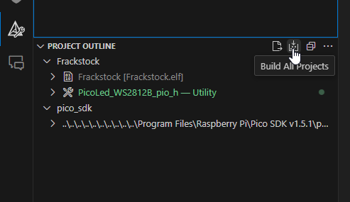

# ET21-Frackstock-FW

## Flash instruction
1. Press <kbd>BOOTSEL</kbd> button on Pico board
2. Plug in the device to PC (or press reset if possible)
3. Release <kbd>BOOTSEL</kbd>
4. Copy `*.uf2` file to the Pico mounted as a drive. The script will run on complete

## Development
At the moment, setup in windows is the easiest. Mac OS and Linux need more manual steps to setup

### Windows Setup
Follow the guide and installer
 - Github: [pico-setup-windows](https://github.com/raspberrypi/pico-setup-windows/)
 - Guide: [Raspberry Pi Pico Windows Installer](https://www.raspberrypi.com/news/raspberry-pi-pico-windows-installer/)
 - Use the VS Code version tagged with "Pico"

### CMakeLists
New sources must be added in file `CMakeLists.txt`

```makefile
add_executable(Frackstock
    source/main.cpp
    source/led_ring.cpp
    #... Add new source here
)
```

### Building

Press **Build All Projects** in cmake sidebar.

Executable is located in `build/Frackstock.uf2`


